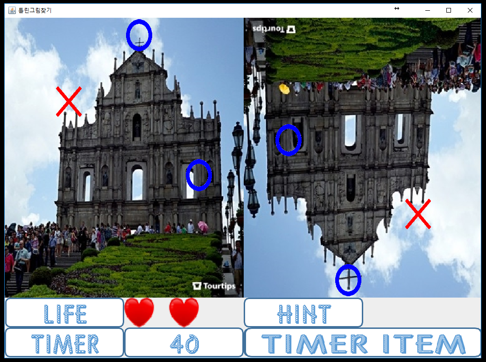

# Wrong_Picture

## Summary

Maintain existing game method but add new game method. It was developed for the purpose of improving the completeness and satisfaction of the game with the difference from the existing game. The goal of this project is to understand the Java language and learn how to use the GUI environment of Java.

In eclipse, open the project.

This picture is start view.

Three stage are exist. Easy, Normal and Hard.

Easy stage is simple. In two pictures, find the different part.

Right answer, show O mark.
Wrong answer, show X mark.

Three opportunities are given.
60 seconds are given.

Hint item is showing different part for a while.
Timer item is extending timer.

Normal stage is little hard.
Original image and reverse image are given.

Hard stage is very hard.
Rectangle is moved 4 area, left-top, right-top, right-bottom, left-bottom each 10 seconds.

Each stage have five steps.

Enjoy Game!!
